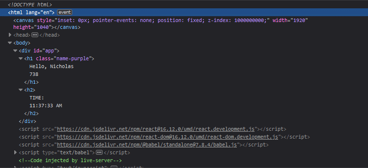

# MAIN CONCEPTS

## Hello World

```html
<!DOCTYPE html>
<html lang="en">
<head>
    <meta charset="UTF-8">
    <meta name="viewport" content="width=device-width, initial-scale=1.0">
    <meta http-equiv="X-UA-Compatible" content="ie=edge">
    <title>Document</title>
    <style type="text/css">
        #app {
            color: #61dafb;
        }
    </style>
</head>
<body>
    <div id="app"></div>

    <!-- 
    <script crossorigin src="https://unpkg.com/react@16.12.0/umd/react.development.js"></script>
    <script crossorigin src="https://unpkg.com/react-dom@16.12.0/umd/react-dom.development.js"></script> 
    <script crossorigin src="https://unpkg.com/babel-standalone@7.0.0-beta.3/babel.min.js"></script>    
    -->
    <script src="https://cdn.jsdelivr.net/npm/react@16.12.0/umd/react.development.js"></script>
    <script src="https://cdn.jsdelivr.net/npm/react-dom@16.12.0/umd/react-dom.development.js"></script>
    <script src="https://cdn.jsdelivr.net/npm/@babel/standalone@7.8.4/babel.min.js"></script>
    <script type="text/babel">
        // 1. 虚拟 DOM 元素对象，不是字符串；
        // 重要：没有报错的原因在于该脚本 type 为 “text/babel”，
        // "text/babel" 声明，告知 babel.js 解析里面的代码，前提使需要引入 babel.js 文件
        const vDom = <h1>Hello, world!</h1>;
        // 2. 将 虚拟 DOM 元素对象渲染到页面真实 DOM 容器中
        ReactDOM.render(vDom, document.querySelector('#app'))
    </script>
</body>
</html>
```


## Introducing JSX

```js
// The tag syntax is neither a string nor html
const element = <h1>Hello, world!</h1>
```

> JSX, that is a syntax extension to JavaScript. 

JSX 可以很好的描述 UI 应该呈现出它应有交互的本质形式。

### Why JSX

React 认为渲染逻辑本质上与其他 UI 逻辑内在耦合，比如，在 UI 中需要绑定处理事件、在某些时刻状态发生变化时需要通知到 UI，以及需要在 UI 中展示准备好的数据。

### Embedding Expressions in JSX

```javascript
const name = 'Nicholas'
const element = <h1>Hello, {name}</h1>

ReactDOM.render(element, document.querySelector('#app'))
```

在 JSX 语法中，你可以在大括号内放置任何有效的 JavaScript 表达式。

```javascript
// 在 JSX 中嵌入表达式
function formatName(user) {
    return user.firstName + ' ' + user.lastName
}

const user = {
    firstName: 'Nicholas',
    lastName: 'Eee'
}

const vDomEle = (
    <h1>
        Hello, {formatName(user)}
    </h1>
)

ReactDOM.render(vDomEle, document.querySelector('#app'))
```

### JSX is an Expression Too

> After compilation, JSX expressions become regular JavaScript function calls and evaluate to JavaScript objects.

```javascript
// 可以在 if 语句和 for 语句循环的代码块中使用 JSX
function getGreeting(user) {
    if (user) {
        return <h1>Hello, {formatName(user)}!</h1>
    } else {
        return <h1>Hello, Nicholas.</h1>
    }
}
```

### Specifying Attributes with JSX

```javascript
// You can use quotes to specify string literals as attributes
const element = <div tabIndex="0"></div>
```

```javascript
// You may also use curly braces to embed a JavaScript expression in an attribute
const element = 
```

> Don’t put quotes around curly braces when embedding a JavaScript expression in an attribute. You should either use quotes (for string values) or curly braces (for expressions), but not both in the same attribute.

**重要** 由于 JSX 的语法更加接近 JavaScript 而不是 HTML，所以 ReactDOM 使用 `camelCase`（小驼峰命名）来定义属性的名称，而不使用 HTML 属性名称的命名约定。

比如：`class` -> `className`、`tabindex` -> `tabIndex`

### Specifying Children with JSX

> If a tag is empty, you may close it immediately with `/>`，like XML:

```javascript
const element = 
```

> JSX tags may contain chilren:

```javascript
<div>
    <h1>Hello, {formatName(user)}</h1>
    
</div>
```

> React 中的一个常见模式是一个组件返回多个元素。Fragments 允许你将子列表分组，而无需向 DOM 添加额外节点。

> `<></>` 是 `<React.Fragment></React.Fragment>` 的 短语法；但不支持 key 或 属性

```javascript
<Fragment>
    <h1>Hello, {formatName(user)}</h1>
    
</Fragment>

// 等效于

<>
    <h1>Hello, {formatName(user)}</h1>
    
</>
```

### JSX Prevents Injection Attacks

可以安全地在 JSX 当中插入用户输入的内容：

```javascript
const title = response.potentiallyMaliciousInput;
// 直接使用是安全的，放心大胆使用吧 ~
const element = <h1>{title}</h1>
```

ReactDOM 在渲染所有输入内容之前，默认会进行转义。它可以确保在你的应用中，永远不会注入那些并非自己明确编写的内容。所有的内容在渲染之前都被转义成了字符串；可有效防止 `XSS (cross-site-scripting 跨站脚本攻击)` 攻击

### JSX Represents Objects 

> Babel compiles JSX down to `React.createElement()` calls.

Babel 会把 JSX 转译成一个名为 `React.createElement()` 函数调用。

也就是说：

```javascript
const element = (
    <h1 className="greeting">
        Hello, world
    </h1>
)

// 等效于

const element = React.createElement('h1', {className: 'greeting'}, 'Hello, world')

// 实际上会创建类似这样的一个对象：
// 注意：这里只是简单地描述这个 JSX 对象的结构
const element = {
    type: 'h1',
    props: {
        className: 'greeting',
        children: 'Hello, world'
    }
}
```


## Rendering Elements

> Elements are the smallest building blocks of React apps.

元素是 React 应用程序的最小构建块。

### Rendering an Element into the DOM

```html
<!-- "root" DOM node，everything inside it will be managed by React DOM -->
<div id="root"></div>
```

通常，使用 React 构建的应用只有单一的根 DOM 节点。如果想要将一个 React 元素渲染到根 DOM 节点中，只需要把它们一起传入 `ReactDOM.render(element, container[, callback])`。

就像最初的 `Hello, world` 例子一样：

```javascript
// vDom 就是 “React 元素”
const vDom = <h1>Hello, world!</h1>;
ReactDOM.render(vDom, document.querySelector('#app'))
```

### Updating the Rendered Element

> React elements are `immutable`. Once you create an element, you can't change its children or attributes.

那么，在当前（前面已了解到的知识）我们该如何更新已渲染的元素呢？

唯一的方式就是创建一个新的 React 元素，并将其传入到 `ReactDOM.render(element, container[, callback])` ，重新渲染到根节点：

```javascript
const tick = () => {
    const element = (
        <>
            <h1 className="name-purple">Hello, Nicholas</h1>
            <h2>TIME: { new Date().toLocaleTimeString() }</h2>
        </>
    )

    ReactDOM.render(element, document.querySelector('#app'))
}

setInterval(tick, 1000)
```

> **注意：** 在实际的 React 应用中只会调用一次 `ReactDOM.render(element, container[, callback])`; 

### React Only Updates What's Necessary

> React DOM compares the element and its children to the previous one, and only applies the DOM updates necessary to bring the DOM to the desired state.



从上图可以清晰看到，尽管每一秒我们都会新创建一个描述整个 UI 树的元素，React DOM 只会更新实际改变了的内容，也就是例子中的文本节点。


## Components and Props

> Components let you split the UI into independent, reusable pieces and think about each piece in isolation.

组件允许你将 UI 拆分为独立的、可复用的代码片段，并单独考虑每个代码片段。

Conceptually, components are like JavaScript functions. They accept arbitrary(任意地) inputs (called "props") and return React elements describing what should appear on the screen.

### 模块与组件 和 模块化与组件化

- **模块**

模块就是向外提供特定功能的 js 程序，一般就是一个 js 文件；目的是为了复用 js ，简化 js 的编写，提高 js 运行效率。

- **组件**

用来实现特定（局部）功能效果的代码集合（html/css/js），在较高层面上来看，其实就是一个自定义的包含特定动能的元素。

### Function and Class Components

```javascript
// 1. Function Components
// 接收唯一带有数据的 "props"
const FunComponent = (props) => {
    console.log(props)
    return (
        <> 
            <h1>Hello, { props.name }</h1>
            <h3>Function Components (函数组件 —— 简单组件)</h3>
        </>
    )
}

// 渲染组件
ReactDOM.render(<FunComponent name="Nicholas" />, document.querySelector('#rootByFunComponents'))

// 2. Class Components
class ClassComponent extends React.Component {
    render() {
        // 打印实例对象
        console.log(this)
        return (
            <> 
                <h1>Hello, { this.props.name }</h1>
                <h3>Class Components (ES6类组件 —— 复杂组件)</h3>
            </>
        ) 
    }
}

// 渲染组件
ReactDOM.render(<ClassComponent name="Nicholas1" />, document.querySelector('#rootByClassComponents'))
```

> **注意：组件名称必须以大写字母开头。**
>
> React 会将以小写字母开头的组件视为原生 DOM 标签。

### Composing Components

定义组件的时候，可以引用其他组件。利用这一特性，我们可以用同一组件抽象出任意层次的细节。按钮、表单、对话框、甚至整个屏幕的内容：在 React 应用程序中，这些通常都会以组件的形式表示。

```javascript
// 组合组件
const HelloComponent = (props) => {
    return <h1>Hello, { props.name }</h1>
}

const App = () => {
    return (
        <> 
            <HelloComponent name="Nicholas" />
            <HelloComponent name="Sara" />
            <HelloComponent name="Ethan" />
        </>
    )
}

ReactDOM.render(<App />, document.querySelector('#rootByFunComponents'))
```

### Props

组件无论使用函数声明还是通过 class 声明，都决不能修改自身的 `props`。

> 所有 React 组件都必须像纯函数一样保护它们的 props 不被更改。

#### 需求：自定义一个组件，用来显示一个人员信息

说明：1.如果性别没有指定，默认为“男“；2.如果年龄没有指定，默认为“18”

```javascript
/**
* 需求：自定义一个组件，用来显示一个人员信息
* 说明：1.如果性别没有指定，默认为“男“；2.如果年龄没有指定，默认为“18”
*/
const Person = props => {
    console.log(props);
    return (
        <>
            <div>Name: { props.name }</div>
            <div>Age: { props.age }</div>
            <div>Sex: { props.sex }</div>
        </>
    );
};

// class Person extends React.Component {
//     render () {
//         console.log(this)
//         return (
//             <>
//                 <div>Name: { this.props.name }</div>
//                 <div>Age: { this.props.age }</div>
//                 <div>Sex: { this.props.sex }</div>
//             </>
//         )
//     }
// }

// defaultProps 
// 可以为组件添加默认 props。这一般用于 props 未赋值，但又不能为 null 的情况
Person.defaultProps = {
    age: 18,
    sex: 'Male'
}

const UserName = {
    name: "Nicholas",
    age: 20
};

let element = <Person name={ UserName.name } age={ UserName.age } sex={ UserName.sex } />;

const container = document.querySelector("#rootByFunComponents");

// 组件属性设置的两种方式（暂时已知的 😂）

// 1. 显示指定各个属性：（JavaScript表达式，字符串字面量，Props默认值为 ”True“）
// ReactDOM.render(element, container);

// 2. 使用 ES6 的扩展符 Spread Attributes
ReactDOM.render(<Person { ...UserName } />, container);
```

## State and Lifecycle


