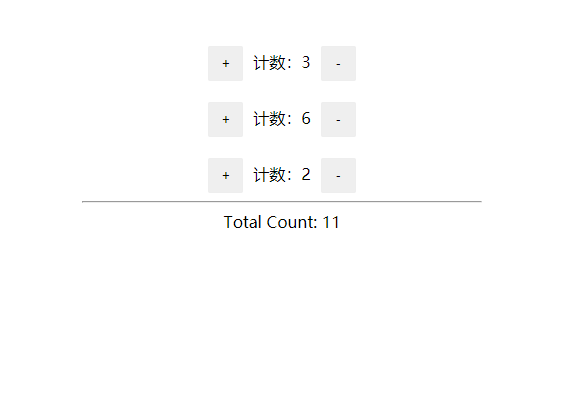

# MAIN CONCEPTS

## # Hello World

```html
<!DOCTYPE html>
<html lang="en">
  <head>
    <meta charset="UTF-8" />
    <meta name="viewport" content="width=device-width, initial-scale=1.0" />
    <meta http-equiv="X-UA-Compatible" content="ie=edge" />
    <title>Document</title>
    <style type="text/css">
      #app {
        color: #61dafb;
      }
    </style>
  </head>
  <body>
    <div id="app"></div>

    <!-- 
    <script crossorigin src="https://unpkg.com/react@16.12.0/umd/react.development.js"></script>
    <script crossorigin src="https://unpkg.com/react-dom@16.12.0/umd/react-dom.development.js"></script> 
    <script crossorigin src="https://unpkg.com/babel-standalone@7.0.0-beta.3/babel.min.js"></script>    
    -->
    <script src="https://cdn.jsdelivr.net/npm/react@16.12.0/umd/react.development.js"></script>
    <script src="https://cdn.jsdelivr.net/npm/react-dom@16.12.0/umd/react-dom.development.js"></script>
    <script src="https://cdn.jsdelivr.net/npm/@babel/standalone@7.8.4/babel.min.js"></script>
    <script type="text/babel">
      // 1. 虚拟 DOM 元素对象，不是字符串；
      // 重要：没有报错的原因在于该脚本 type 为 “text/babel”，
      // "text/babel" 声明，告知 babel.js 解析里面的代码，前提使需要引入 babel.js 文件
      const vDom = <h1>Hello, world!</h1>
      // 2. 将 虚拟 DOM 元素对象渲染到页面真实 DOM 容器中
      ReactDOM.render(vDom, document.querySelector("#app"))
    </script>
  </body>
</html>
```

## # Introducing JSX

```js
// The tag syntax is neither a string nor html
const element = <h1>Hello, world!</h1>
```

> JSX, that is a syntax extension to JavaScript.

JSX 可以很好的描述 UI 应该呈现出它应有交互的本质形式。

### # Why JSX

React 认为渲染逻辑本质上与其他 UI 逻辑内在耦合，比如，在 UI 中需要绑定处理事件、在某些时刻状态发生变化时需要通知到 UI，以及需要在 UI 中展示准备好的数据。

### # Embedding Expressions in JSX

```javascript
const name = "Nicholas"
const element = <h1>Hello, {name}</h1>

ReactDOM.render(element, document.querySelector("#app"))
```

在 JSX 语法中，你可以在大括号内放置任何有效的 JavaScript 表达式。

```javascript
// 在 JSX 中嵌入表达式
function formatName(user) {
  return user.firstName + " " + user.lastName
}

const user = {
  firstName: "Nicholas",
  lastName: "Eee"
}

const vDomEle = <h1>Hello, {formatName(user)}</h1>

ReactDOM.render(vDomEle, document.querySelector("#app"))
```

### # JSX is an Expression Too

> After compilation, JSX expressions become regular JavaScript function calls and evaluate to JavaScript objects.

```javascript
// 可以在 if 语句和 for 语句循环的代码块中使用 JSX
function getGreeting(user) {
  if (user) {
    return <h1>Hello, {formatName(user)}!</h1>
  } else {
    return <h1>Hello, Nicholas.</h1>
  }
}
```

### # Specifying Attributes with JSX

```javascript
// You can use quotes to specify string literals as attributes
const element = <div tabIndex="0"></div>
```

```javascript
// You may also use curly braces to embed a JavaScript expression in an attribute
const element = 
```

> Don’t put quotes around curly braces when embedding a JavaScript expression in an attribute. You should either use quotes (for string values) or curly braces (for expressions), but not both in the same attribute.

**重要** 由于 JSX 的语法更加接近 JavaScript 而不是 HTML，所以 ReactDOM 使用 `camelCase`（小驼峰命名）来定义属性的名称，而不使用 HTML 属性名称的命名约定。

比如：`class` -> `className`、`tabindex` -> `tabIndex`

### # Specifying Children with JSX

> If a tag is empty, you may close it immediately with `/>`，like XML:

```javascript
const element = 
```

> JSX tags may contain chilren:

```javascript
<div>
  <h1>Hello, {formatName(user)}</h1>
  
</div>
```

> React 中的一个常见模式是一个组件返回多个元素。Fragments 允许你将子列表分组，而无需向 DOM 添加额外节点。

> `<></>` 是 `<React.Fragment></React.Fragment>` 的 短语法；但不支持 key 或 属性

```javascript
<Fragment>
    <h1>Hello, {formatName(user)}</h1>
    
</Fragment>

// 等效于

<>
    <h1>Hello, {formatName(user)}</h1>
    
</>
```

### # JSX Prevents Injection Attacks

可以安全地在 JSX 当中插入用户输入的内容：

```javascript
const title = response.potentiallyMaliciousInput
// 直接使用是安全的，放心大胆使用吧 ~
const element = <h1>{title}</h1>
```

ReactDOM 在渲染所有输入内容之前，默认会进行转义。它可以确保在你的应用中，永远不会注入那些并非自己明确编写的内容。所有的内容在渲染之前都被转义成了字符串；可有效防止 `XSS (cross-site-scripting 跨站脚本攻击)` 攻击

### # JSX Represents Objects

> Babel compiles JSX down to `React.createElement()` calls.

Babel 会把 JSX 转译成一个名为 `React.createElement()` 函数调用。

也就是说：

```javascript
const element = <h1 className="greeting">Hello, world</h1>

// 等效于

const element = React.createElement("h1", { className: "greeting" }, "Hello, world")

// 实际上会创建类似这样的一个对象：
// 注意：这里只是简单地描述这个 JSX 对象的结构
const element = {
  type: "h1",
  props: {
    className: "greeting",
    children: "Hello, world"
  }
}
```

## # Rendering Elements

> Elements are the smallest building blocks of React apps.

元素是 React 应用程序的最小构建块。

### # Rendering an Element into the DOM

```html
<!-- "root" DOM node，everything inside it will be managed by React DOM -->
<div id="root"></div>
```

通常，使用 React 构建的应用只有单一的根 DOM 节点。如果想要将一个 React 元素渲染到根 DOM 节点中，只需要把它们一起传入 `ReactDOM.render(element, container[, callback])`。

就像最初的 `Hello, world` 例子一样：

```javascript
// vDom 就是 “React 元素”
const vDom = <h1>Hello, world!</h1>
ReactDOM.render(vDom, document.querySelector("#app"))
```

### # Updating the Rendered Element

> React elements are `immutable`. Once you create an element, you can't change its children or attributes.

那么，在当前（前面已了解到的知识）我们该如何更新已渲染的元素呢？

唯一的方式就是创建一个新的 React 元素，并将其传入到 `ReactDOM.render(element, container[, callback])` ，重新渲染到根节点：

```javascript
const tick = () => {
  const element = (
    <>
      <h1 className="name-purple">Hello, Nicholas</h1>
      <h2>TIME: {new Date().toLocaleTimeString()}</h2>
    </>
  )

  ReactDOM.render(element, document.querySelector("#app"))
}

setInterval(tick, 1000)
```

> **注意：** 在实际的 React 应用中只会调用一次 `ReactDOM.render(element, container[, callback])`;

### # React Only Updates What's Necessary

> React DOM compares the element and its children to the previous one, and only applies the DOM updates necessary to bring the DOM to the desired state.


从上图可以清晰看到，尽管每一秒我们都会新创建一个描述整个 UI 树的元素，React DOM 只会更新实际改变了的内容，也就是例子中的文本节点。

## # Components and Props

> Components let you split the UI into independent, reusable pieces and think about each piece in isolation.

组件允许你将 UI 拆分为独立的、可复用的代码片段，并单独考虑每个代码片段。

Conceptually, components are like JavaScript functions. They accept arbitrary(任意地) inputs (called "props") and return React elements describing what should appear on the screen.

### # 模块与组件 和 模块化与组件化

- **模块**

模块就是向外提供特定功能的 js 程序，一般就是一个 js 文件；目的是为了复用 js ，简化 js 的编写，提高 js 运行效率。

- **组件**

用来实现特定（局部）功能效果的代码集合（html/css/js），在较高层面上来看，其实就是一个自定义的包含特定动能的元素。

### # Function and Class Components

```javascript
// 1. Function Components
// 接收唯一带有数据的 "props"
const FunComponent = props => {
  console.log(props)
  return (
    <>
      <h1>Hello, {props.name}</h1>
      <h3>Function Components (函数组件 —— 简单组件)</h3>
    </>
  )
}

// 渲染组件
ReactDOM.render(<FunComponent name="Nicholas" />, document.querySelector("#rootByFunComponents"))

// 2. Class Components
class ClassComponent extends React.Component {
  render() {
    // 打印实例对象
    console.log(this)
    return (
      <>
        <h1>Hello, {this.props.name}</h1>
        <h3>Class Components (ES6类组件 —— 复杂组件)</h3>
      </>
    )
  }
}

// 渲染组件
ReactDOM.render(<ClassComponent name="Nicholas1" />, document.querySelector("#rootByClassComponents"))
```

> **注意：组件名称必须以大写字母开头。**
>
> React 会将以小写字母开头的组件视为原生 DOM 标签。

### # Composing Components

定义组件的时候，可以引用其他组件。利用这一特性，我们可以用同一组件抽象出任意层次的细节。按钮、表单、对话框、甚至整个屏幕的内容：在 React 应用程序中，这些通常都会以组件的形式表示。

```javascript
// 组合组件
const HelloComponent = props => {
  return <h1>Hello, {props.name}</h1>
}

const App = () => {
  return (
    <>
      <HelloComponent name="Nicholas" />
      <HelloComponent name="Sara" />
      <HelloComponent name="Ethan" />
    </>
  )
}

ReactDOM.render(<App />, document.querySelector("#rootByFunComponents"))
```

### # Props

`props` 是用于整个组件树中 `传递数据` 和 `配置`；在当前组件访问 `props`，使用 `this.props`。

组件无论使用函数声明还是通过 class 声明，都决不能修改自身的 `props`。

> 所有 React 组件都必须像纯函数一样保护它们的 props 不被更改。

#### # 需求：自定义一个组件，用来显示一个人员信息

说明：1.如果性别没有指定，默认为“男“；2.如果年龄没有指定，默认为“18”

```javascript
/**
 * 需求：自定义一个组件，用来显示一个人员信息
 * 说明：1.如果性别没有指定，默认为“男“；2.如果年龄没有指定，默认为“18”
 */
const Person = props => {
  console.log(props)
  return (
    <>
      <div>Name: {props.name}</div>
      <div>Age: {props.age}</div>
      <div>Sex: {props.sex}</div>
    </>
  )
}

// class Person extends React.Component {
//     render () {
//         console.log(this)
//         return (
//             <>
//                 <div>Name: { this.props.name }</div>
//                 <div>Age: { this.props.age }</div>
//                 <div>Sex: { this.props.sex }</div>
//             </>
//         )
//     }
// }

// defaultProps
// 可以为组件添加默认 props。这一般用于 props 未赋值，但又不能为 null 的情况
Person.defaultProps = {
  age: 18,
  sex: "Male"
}

const UserName = {
  name: "Nicholas",
  age: 20
}

let element = <Person name={UserName.name} age={UserName.age} sex={UserName.sex} />

const container = document.querySelector("#rootByFunComponents")

// 组件属性设置的两种方式（暂时已知的 😂）

// 1. 显示指定各个属性：（JavaScript表达式，字符串字面量，Props默认值为 ”True“）
// ReactDOM.render(element, container);

// 2. 使用 ES6 的扩展符 Spread Attributes
ReactDOM.render(<Person {...UserName} />, container)
```

## # State and Lifecycle

在元素渲染章节，我们了解了一种更新 UI 界面的方法：通过调用 `ReactDOM.render()` 来修改需要渲染的元素

```javascript
const tick = () => {
  const element = (
    <>
      <h1 className="name-purple">Hello, Nicholas</h1>
      <h2>TIME: {new Date().toLocaleTimeString()}</h2>
    </>
  )

  ReactDOM.render(element, document.querySelector("#app"))
}

setInterval(tick, 1000)
```

本章节将基于这个例子继续学习另外的实现 UI 界面更新的方法。

### # 需求：封装一个可复用的 `Clock` 组件

```javascript
/**
 * 需求：封装真正可复用的 Clock 组件
 */
const Clock = props => {
  return (
    <>
      <h1>Hello, {props.name}</h1>
      <h2>{props.date.toLocaleTimeString()}</h2>
    </>
  )
}

const container = document.querySelector("#app")

const tick = () => {
  ReactDOM.render(<Clock date={new Date()} />, container)
}

setInterval(tick, 1000)
```

但是，上面的实现缺少了一个关键的技术细节：`Clock` 组件需要设置一个自己的计时器并每秒更新一次。

理想情况下，我们希望只编写一次渲染代码，便可让 `Clock` 组件实现自我更新。

如此，我们需要引入一个新的概念：State 。State 与 Props 类似，但是 state 是私有的，并且完全受控于当前组件。

> State 本质控制的是组件状态，而函数组件是无状态组件，所以当使用 state 时，必须是在 Class 组件里面使用

```javascript
/**
 * 需求：封装真正可复用的 Clock 组件
 * 说明：将函数组件转换成 class 组件
 */
// 1. 创建一个同名的 ES6 class, 并继承于 `React.Component`
// 2. 添加一个空的 `render()` 方法
// 3. 将函数体移到 `render()` 方法之中
// 4. 在 `render()` 方法中使用 `this.props` 替换 `props`
// 5. 移除 `setInterval()` 方法，只保留 `ReactDOM.render()`
class Clock extends React.Component {
  render() {
    return (
      <>
        <h1>Hello, {this.props.name}</h1>
        <h2>{this.props.date.toLocaleTimeString()}</h2>
      </>
    )
  }
}

const container = document.querySelector("#app")

ReactDOM.render(<Clock date={new Date()} />, container)
```

现在 `Clock` 组件被定义为 class，而不是函数。

每次组件更新时 `render` 方法都会被调用，但只要在相同的 DOM 节点中渲染 `<Clock />`，就仅有一个 `Clock` 组件的 class 实例被创建使用。

```javascript
/**
 * 需求：封装真正可复用的 Clock 组件
 * 说明：向 class 组件中添加局部的 state
 */
class Clock extends React.Component {
  // Class 组件应该始终使用 props 参数来调用父类的构造函数
  constructor(props) {
    super(props)
    // this.state 赋初值
    this.state = { date: new Date() }
  }

  render() {
    return (
      <>
        <h1>Hello, {this.props.name}</h1>
        <h2>{this.state.date.toLocaleTimeString()}</h2>
      </>
    )
  }
}

const container = document.querySelector("#app")

ReactDOM.render(<Clock name="Nicholas" />, container)
```

> Class 组件应该始终使用 `props` 参数来调用父类的构造函数

```javascript
/**
 * 需求：封装真正可复用的 Clock 组件
 * 说明：设置自己的计时器并每秒更新一次 —— 通过生命周期函数实现 state 自动更新
 */
class Clock extends React.Component {
  // Class 组件应该始终使用 props 参数来调用父类的构造函数
  constructor(props) {
    super(props)
    // this.state 赋初值
    this.state = { date: new Date() }
  }

  // `componentDidMount()` 方法会在组件已经被渲染到 DOM 中后运行
  componentDidMount() {
    this.timerId = setInterval(() => this.tick(), 1000)
  }

  componentWillUnmount() {
    clearInterval(this.timerId)
  }

  tick() {
    this.setState({
      date: new Date()
    })
  }

  render() {
    return (
      <>
        <h1>Hello, {this.props.name}</h1>
        <h2>{this.state.date.toLocaleTimeString()}</h2>
      </>
    )
  }
}

const container = document.querySelector("#app")

ReactDOM.render(<Clock name="Nicholas" />, container)
```

1. 当 `<Clock />` 传给 `ReactDOM.render()` 的时候，React 会调用 `Clock` 组件的构造函数：初始化 `this.state`;

2. 之后 React 会调用组件的 `render()` 方法，将组件渲染到页面上显示；

3. 当 `Clock` 组件插入到 DOM 中后，React 就会调用 `ComponentDidMount()` 生命周期方法；

4. `ComponentDidMount()` 方法中实现了一个计时器，浏览器每秒都会调用一次 `tick()` 方法。在这个方法中，`Clock` 组件会通过调用 `setState()` 来更新状态，当状态发生改变，React 便会重新调用 `render()` 方法来确定页面上该显示什么。`this.state.date` 发生改变，React 会相应的更新 DOM；

5. 一旦 `Clock` 组件从 DOM 中被移除，React 就会调用 `componentWillUnmount()` 生命周期方法；

### # 正确地使用 `State`

关于 `setState()` 需要注意：

- 不要直接修改 `State` ；构造函数是唯一可以给 `this.state` 赋值的地方

```javascript
// Wrong
this.state.comment = "Hello"

// Correct
this.setState({ comment: "Hello" })
```

- `State` 的更新可能是异步的

  出于性能的考虑，React 可能会把多个 `setState()` 调用合并成一个调用；

  由于 `this.props` 和 `this.state` 可能会异步更新，所以不要依赖他们的值来更新下一个状态；

  要解决这个问题，可以让 `setState()` 接收一个函数而不是一个对象。这个函数第一个参数是 `state`, 第二个参数是 `props`，且该函数返回一个对象；

```javascript
// Wrong
this.setState({
  counter: this.state.counter + this.props.increment
})

// Correct
this.setState(function(state, props) {
  return {
    counter: state.counter + props.increment
  }
})

// 或者使用箭头函数
this.setState((state, props) => ({
  counter: state.counter + props.increment
}))
```

- `State` 的更新会被合并

  当你调用 `setState()` 的时候，React 会把你提供的对象合并（浅合并）到当前的 `state`;

```javascript
// 例如：state 中包含几个独立的变量
constructor(props) {
    super(props)
    this.state = {
        posts: [],
        comments: []
    }
}

// 然后可以分别调用 `setState()` 来单独地更新它们
componentDidMount() {
    fetchPosts().then(response => {
        this.setState({
            posts: response.posts
        })
    })

    fetchComments().then(response => {
        // 完整保留了 `this.state.posts`，但完全替换了 `this.state.comments`
        this.setState({
            comments: response.comments
        })
    })
}
```

### # 数据是向下流动的

> Neither parent nor child components can know if a certain(某些、某个) component is stateful or stateless， and they shoudn't care whether it is defined as a function or a class.

不管父组件还是子组件都无法知道某个组件是有状态的还是无状态的，并且它们也并不关心它是函数组件还是 class 组件。

这就是为什么称 `state` 为局部的或是封装的原因。

```html
<!-- 组件可以选择把它的 state 作为 props 向下传递到它的子组件中 -->
<h2>{ this.state.date.toLocaleTimeString() }</h2>

<!-- 这对于自定义组件同样适用 -->
<FomatterDate date="{" this.state.date } />
```

组件本身无法知道它原来是来自于父组件的 state 还是父组件的 props ，还是手动输入的：

```javascript
function FormattedDate(props) {
  return <h2>{props.date.toLocaleTimeString()}</h2>
}
```

这通常被叫做 **自上而下（top-down）** 或是 **单向（unidirectional）** 的数据流。任何的 state 总是所属于特定的组件，而且从该 state 派生的任何数据或 UI 只能影响树中”低于“它们的组件。

> **尽可能使用 `props` 当做数据源，`state` 用来存放状态值（简单的数据）**

### # 需求：实现一个手动计数的应用（一）

说明：设计一个 button 的简单手动计数器应用，点击 "+" button 计数器增加 1，点击 "-" button 计数器减 1；

```javascript
/**
 * 需求：实现一个手动计数的应用
 * 说明：设计一个 button 的简单手动计数器应用，点击 "+" button 计数器增加1，点击 "-" button 计数器减1；
 */
class Counter extends React.Component {
  constructor(props) {
    super(props)

    this.state = {
      initValue: 0
    }

    // 与 render 函数的 onClick 绑定，将 this 绑定为组件对象
    this.onClickAdd = this.onClickAdd.bind(this)
    this.onClickReduce = this.onClickReduce.bind(this)
  }

  onClickAdd() {
    // 内部的 this 默认不是组件对象，而是 undefined；需要主动强制绑定组件对象
    console.log(this)
    // 读取状态并计算
    this.state.initValue++
    // 更新状态 state
    this.setState({
      initValue: this.state.initValue
    })
  }

  onClickReduce() {
    console.log(this)
    this.state.initValue--
    this.setState({
      initValue: this.state.initValue
    })
  }

  render() {
    return (
      <div className="container">
        <button onClick={this.onClickAdd}> + </button>
        <span>计数：{this.state.initValue}</span>
        <button onClick={this.onClickReduce}> - </button>
      </div>
    )
  }
}

const container = document.querySelector("#app")

ReactDOM.render(<Counter initValue="0" />, container)
```

### # 需求：实现一个手动计数的应用（二）

说明：

1. 设计一个 button 的简单手动计数器应用，点击 "+" button 计数器增加 1，点击 "-" button 计数器减 1；

2. 三个同样的计数器手动计数，然后算出最终的计数结果，并展示

   

```javascript
// Parent Component
class TotalCount extends React.Component {
  constructor(props) {
    super(props)
    this.state = {
      totalValue: 0
    }

    this.updateCount = this.updateCount.bind(this)
  }

  updateCount(preValue, newValue) {
    this.setState({
      totalValue: this.state.totalValue + (newValue - preValue)
    })
  }

  render() {
    return (
      <div className="container">
        // 将 updateCount 作为 props 传递给 Child Component
        <Counter aValue="0" updateCount={this.updateCount} />
        <br />
        <br />
        <Counter aValue="0" updateCount={this.updateCount} />
        <br />
        <br />
        <Counter aValue="0" updateCount={this.updateCount} />
        <hr />
        <div> Total Count: {this.state.totalValue} </div>
      </div>
    )
  }
}

// Child Component
class Counter extends React.Component {
  constructor(props) {
    super(props)

    this.state = {
      initValue: this.props.aValue
    }

    // 与 render 函数的 onClick 绑定，将 this 绑定为组件对象
    this.onClickAdd = this.onClickAdd.bind(this)
    this.onClickReduce = this.onClickReduce.bind(this)
  }

  onClickAdd() {
    this.handleUpdateValue(true)
  }

  onClickReduce() {
    this.handleUpdateValue(false)
  }

  handleUpdateValue(flag) {
    const preValue = this.state.initValue
    const newValue = flag ? ++this.state.initValue : --this.state.initValue
    this.setState({
      initValue: newValue
    })
    // 重要：这里将函数作为一个 props 来传递数据
    this.props.updateCount(preValue, newValue)
  }

  render() {
    return (
      <>
        <button onClick={this.onClickAdd}> + </button>
        <span>计数：{this.state.initValue}</span>
        <button onClick={this.onClickReduce}> - </button>
      </>
    )
  }
}

const container = document.querySelector("#app")

ReactDOM.render(<TotalCount />, container)
```

## # Handling Events

> Handling events with React elements is very similar to handling events on DOM elements.

但是有一点语法上的不同：

- React 事件的命名采用小驼峰式（camelCase），而不是纯小写

- 使用 JSX 语法时你需要传入一个函数作为事件处理函数，而不是一个字符串

```html
<!-- DOM 元素事件处理 -->
<button onclick="activateLasers()">
  Activate Lasers
</button>

<!-- React 元素事件处理 -->
<button onClick="{" activateLasers }>
  Activate Lasers
</button>
```

- React 中不能通过返回 `false` 的方式阻止默认行为，必须显式的使用 `preventDefault`

```html
<!-- 传统 html 中 -->
<a herf="#" onclick="console.log('The link was clicked.') return false">
  Click Me
</a>
```

```javascript
// 在 React 中
const ActionLink = () => {
  const handleClick = e => {
    e.preventDefault()
    console.log("The link was clicked.")
  }

  return (
    <a herf="#" onClick={handleClick}>
      Click Me
    </a>
  )
}
```

使用 React 时，一般不需要使用 `addEventListener` 为已创建的 DOM 元素添加监听器；通常只需要在该元素初始渲染的时候添加监听器即可。

```javascript
class Toggle extends React.Component {
  constructor(props) {
    super(props)
    this.state = {
      isToggleOn: true
    }

    // This binding is necessary to make `this` work in the callback
    this.handleClick = this.handleClick.bind(this)
  }

  handleClick() {
    console.log(this)
    this.setState(state => ({ isToggleOn: !state.isToggleOn }))
  }

  render() {
    return <button onClick={this.handleClick}>{this.state.isToggleOn ? "ON" : "OFF"}</button>
  }
}

ReactDOM.render(<Toggle />, document.querySelector("#app"))
```

**必须谨慎对待 JSX 回调函数中的 `this`**，在 JavaScript 中，class 的方法默认不会绑定 `this`。

如果觉得使用 `bind()` 方法绑定 `this` 很麻烦，有两种方式可以解决：

- 如果你正在使用实验性的 `public class fields` 语法，你可以使用 class fields 正确的绑定回调函数；

```javascript
class LoggingButton extends React.Component {
  // This syntax ensures `this` is bound within handleClick.
  // Warning: this is *experimental* syntax.
  handleClick = () => {
    console.log("this is:", this)
  }

  render() {
    return <button onClick={this.handleClick}>Click Me</button>
  }
}
```

**重要**：`Create React App` 默认启用此语法

- 如果没有使用 class fields 语法，你可以在回调中使用箭头函数（arrow function）;

```javascript
class LoggingButton extends React.Component {
  handleClick() {
    console.log("this is:", this)
  }

  render() {
    // This syntax ensures `this` is bound within handleClick.
    // 不推荐这种写法
    return <button onClick={e => this.handleClick(e)}>Click Me</button>
  }
}
```

但此语法的问题在于每次渲染 `LoggingButton` 时都会创建不同的回调函数。大多数情况下，这个是没什么问题的，但如果该回调函数作为 prop 传入子组件时，这些组件可能会进行额外的重新渲染。

通常建议在构造器中绑定或者使用 class fields 语法来避免这类性能问题。

### # Passing Arguments to Event Handlers

在循环中，通常需要为事件处理函数传递额外的参数；

```html
<button onClick={ (e) => this.deleteRow(id, e) }>Delete Row</button>
<button onClick={ this.deleteRow.bind(this, id) }></button>
```

上述两种方式时等价的，分别通过 `箭头函数` 和 `Function.prototype.bind` 来实现；通过箭头函数的方式，事件对象必须显式的进行传递，而通过 `bind` 的方式，事件对象以及更过的参数将会被隐式的进行传递。

## # Conditional Rendering

> In React，you can create distinct components that encapsulate behavior you need. Then, you can render only some of them, depending on the state of your application.

```javascript
const UserGreeting = props => {
  return <h1>Welcom back!</h1>
}

const GuestGreeting = props => {
  return <h1>Please sign up.</h1>
}

const Greeting = props => {
  const isLoggedIn = props.isLoggedIn
  if (isLoggedIn) {
    return <UserGreeting />
  }
  return <GuestGreeting />
}

ReactDOM.render(<Greeting isLoggedIn={false} />, document.querySelector("#app"))
```

### # Element Variables

可以使用变量来存储元素。它可以帮助你有条件地渲染组件的一部分，而其他的渲染部分并不会因此而改变。

```javascript
const UserGreeting = props => {
  return <h1>Welcom back!</h1>
}

const GuestGreeting = props => {
  return <h1>Please sign up.</h1>
}

const Greeting = props => {
  const isLoggedIn = props.isLoggedIn
  if (isLoggedIn) {
    return <UserGreeting />
  }
  return <GuestGreeting />
}

const LoginButton = props => {
  return <button onClick={props.onClick}>Login</button>
}

const LogoutButton = props => {
  return <button onClick={props.onClick}>Logout</button>
}

class LoginControl extends React.Component {
  constructor(props) {
    super(props)
    this.state = { isLoggedIn: false }

    this.handleLoginClick = this.handleLoginClick.bind(this)
    this.handleLogoutClick = this.handleLogoutClick.bind(this)
  }

  handleLoginClick() {
    this.setState({
      isLoggedIn: true
    })
  }

  handleLogoutClick() {
    this.setState({
      isLoggedIn: false
    })
  }

  render() {
    const isLoggedIn = this.state.isLoggedIn
    return (
      <div>
        <h1>Hello, Nicholas</h1>
        <Greeting isLoggedIn={isLoggedIn} />
        {isLoggedIn ? (
          <LogoutButton onClick={this.handleLogoutClick} />
        ) : (
          <LoginButton onClick={this.handleLoginClick} />
        )}
      </div>
    )
  }
}

ReactDOM.render(<LoginControl />, document.querySelector("#app"))
```

上述例子中，我们使用了 `if` 和 `三木运算符` 来完成条件渲染；

常用的条件渲染操作：

- `if` 条件渲染

- 与运算符 `&&`

  `true && expression` 总是返回 `expression`

  `false && expression` 总是返回 `false`

- 三目运算符 `condition ? true : false`

### # Preventing Component from Rendering

在极少数的情况下，可能希望能隐藏组件，即使它已经被其他组件渲染了。若要完成此操作，你可以让 `render` 方法直接返回 `null`，而不进行任何渲染。

```javascript
const WarningBanner = props => {
  // 在组件的 render 方法中返回 null 并不影响组件的生命周期，componentDidUpdate 依然被调用
  if (!props.warn) {
    return null
  }

  return <div className="warning">Warning!</div>
}

class Page extends React.Component {
  constructor(props) {
    super(props)
    this.state = {
      showWarning: true
    }

    this.handleToggleClick = this.handleToggleClick.bind(this)
  }

  handleToggleClick() {
    this.setState(state => ({
      showWarning: !state.showWarning
    }))
  }

  render() {
    return (
      <div>
        <WarningBanner warn={this.state.showWarning} />
        <button onClick={this.handleToggleClick}>{this.state.showWarning ? "Hide" : "Show"}</button>
      </div>
    )
  }
}

ReactDOM.render(<Page />, document.querySelector("#app"))
```

## # Lists and Keys

`map()` 函数可以操作数组的每一项，比如将数组的每一项变双倍：

```javascript
const numbers = [1, 2, 3, 4, 5, 6]
const doubled = numbers.map(number => number * 2)
console.log(doubled)
```

### # 渲染多个组件

```javascript
// arr.map(function(value, index, arr) { ... }) 函数
const numbers = [1, 2, 3, 4, 5, 6]

// 渲染多个组件
// Warning: Each child in a list should have a unique "key" prop.
// const listItems = numbers.map((number) => <li>{ number }</li>)

const listItems = numbers.map((number, index) => <li key={index}>{number}</li>)
ReactDOM.render(<ul>{listItems}</ul>, document.querySelector("#app"))
```

### # 基础列表组件

通常需要在一个组件中渲染列表

```javascript
// 基础列表组件
const NumberList = props => {
  const numbers = props.numbers
  // key: 帮助 React 识别哪些元素改变了，因此应当给数组的每一个元素赋予一个确定的标识
  // **一个元素的 key 最好是这个元素在列表中拥有的一个独一无二的字符串**，一般使用数据中的 ID 作为 key
  // 通常没有确定 ID 的时候，才考虑使用元素的索引 index 作为 key
  const listItems = numbers.map(number => <li key={number.toString()}>{number}</li>)
  return <ul>{listItems}</ul>
}

const numbers = [1, 2, 3, 4, 5, 6]

ReactDOM.render(<NumberList numbers={numbers} />, document.querySelector("#app"))
```

> key 会传递信息给 React ，但不会传递给你的组件。

### # 用 key 提取组件

元素的 key 只有放在就近的数组上下文中才有意义。

```javascript
// 提取出一个 ListItem 组件
const ListItem = props => {
  const value = props.value
  return (
    // Wrong: There is no need to specify the key here:
    // <li key={ value.toString() }>
    //     { value }
    // </li>

    <li>{value}</li>
  )
}

// 基础列表组件
const NumberList = props => {
  const numbers = props.numbers
  // Wrong: The key should have been specified here:
  // const listItems = numbers.map((number) => <NumberList value={ number } />)

  const listItems = numbers.map(number => (
    // Correct: Key should be specified inside the array
    <NumberList key={number.toString()} value={number} />
  ))

  return <ul>{listItems}</ul>
}

const numbers = [1, 2, 3, 4, 5, 6]

ReactDOM.render(<NumberList numbers={numbers} />, document.querySelector("#app"))
```

### # key 只是在兄弟节点之间必须唯一

> Keys used within arrays should be unique among their siblings. However they don’t need to be globally unique.

**😂 表示这个没整明白啥意思！！！**

```javascript
const Blog = props => {
  const sidebar = (
    <ul>
      {props.posts.map(post => (
        <li key={post.id}>{post.title}</li>
      ))}
    </ul>
  )

  const content = props.posts.map(post => (
    <div key={post.id}>
      <h3>{post.title}</h3>
      <p>{post.content}</p>
    </div>
  ))

  return (
    <div>
      {sidebar}
      <hr />
      {content}
    </div>
  )
}

const posts = [
  { id: 1, title: "Hello, Nicholas", content: "Welcom to learning React!" },
  { id: 2, title: "Installation", content: "You can intall React from npm" }
]

ReactDOM.render(<Blog posts={posts} />, document.querySelector("#app"))
```

### # 在 JSX 中嵌入 `map()`

JSX 允许在大括号中 `嵌入任何表达式` ：

```javascript
const NumberList = props => {
  const numbers = props.numbers
  return (
    <ul>
      {numbers.map(number => (
        <ListItem key={number.toString()} value={number} />
      ))}
    </ul>
  )
}
```

> 避免滥用这种风格；如果一个 `map()` 嵌套了太多层级，那可能就需要提取组件了。

## # Forms

> 在 React 里，HTML 表单元素的工作方式和其他的 DOM 元素有些不同，这是因为表单元素通常会保持一些内部的 state。

```html
<form>
  <label> 名字：<input type="text" name="name" /> </label>
  <input type="submit" value="提交" />
</form>
```

此表单具有默认的 HTML 表单行为，即在用户提交表单后浏览到新页面。

### # Controlled Components 受控组件

在 HTML 中，表单元素（`<input>`, `<textarea />`, `<input />`）之类的表单元素通常自己维护 `state`，并根据用户输入进行更新。而在 React 中，可变状态（mutable state）通常保存在组件的 state 属性中，并且只能通过使用 `setState()` 来更新。

将两者结合起来，使 React 的 state 成为 “唯一数据源”。渲染表单的 React 组件还控制着用户输入过程中表单发生的操作。被 React 以这种方式控制取值的表单输入元素就叫做"受控组件"。

举个栗子：让前一个示例在提交时打印出名称 —— 将表单写为受控组件

```javascript
class NameForm extends React.Component {
  constructor(props) {
    super(props)
    this.state = { value: "" }

    this.handleChange = this.handleChange.bind(this)
    this.handleSubmit = this.handleSubmit.bind(this)
  }

  // 对于受控组件来说，每个 state 突变都有一个相关的处理函数。这使得修改或验证用户输入变得简单。
  handleChange(event) {
    this.setState({
      value: event.target.value
    })
  }

  handleSubmit(event) {
    event.preventDefault()
    alert("提交的名字：" + this.state.value)
  }

  render() {
    // 由于在表单元素上设置了 `value` 属性，因此显示的值将始终为 `this.state.value`;
    // 使得 React 的 state 成为唯一数据源
    return (
      <form onSubmit={this.handleSubmit}>
        <label>
          名字：
          <input type="text" value={this.state.value} onChange={this.handleChange} />
        </label>
        <input type="submit" value="提交" />
      </form>
    )
  }
}

ReactDOM.render(<NameForm />, document.querySelector("#app"))
```

### # The textarea Tag

在 HTML 中，`<textarea>` 元素通过其子元素定义其文本：

```html
<textarea>
    Hello there, this is some text in a text area
</textarea>
```

而在 React 中，`<textarea>` 使用 `value` 属性代替；使得使用 `<textarea>` 的表单和使用单行 input 的表单非常类似：

```javascript
class EssayForm extends React.Component {
  constructor(props) {
    super(props)
    this.state = { value: "" }

    this.handleChange = this.handleChange.bind(this)
    this.handleSubmit = this.handleSubmit.bind(this)
  }

  handleChange(event) {
    this.setState({
      value: event.target.value
    })
  }

  handleSubmit(event) {
    event.preventDefault()
    alert("An essay war submited: " + this.state.value)
  }

  render() {
    return (
      <form onSubmit={this.handleSubmit}>
        <label>
          文章：
          <textarea
            placeholder="Please write an essay about your favorite DOM element."
            value={this.state.value}
            onChange={this.handleChange}
            rows="10"
            cols="60"
          />
        </label>
        <input type="submit" value="提交" />
      </form>
    )
  }
}

ReactDOM.render(<EssayForm />, document.querySelector("#app"))
```

### # The select Tag

在 HTML 中，`<select>` 创建下拉列表标签：

```html
<select>
  <option value="grapefruit">葡萄柚</option>
  <option value="lime">酸橙</option>
  <option selected value="coconut">椰子</option>
  <option value="mango">芒果</option>
</select>
```

由于 `selected` 属性的远古，椰子选项默认被选中。但是，在 React 中并不会使用 `selected` 属性，而是在根 `select` 标签上使用 `value` 属性。在在受控组件中更便捷，因为只需要在根标签中更新它即可：

```javascript
// React 并不会使用 `selected` 属性，而是在根 `select` 标签上使用 `value` 属性
class FlavorForm extends React.Component {
  constructor(props) {
    super(props)
    this.state = { value: "coconut" }

    this.handleChange = this.handleChange.bind(this)
    this.handleSubmit = this.handleSubmit.bind(this)
  }

  handleChange(event) {
    console.log(event.target)
    this.setState({
      value: event.target.value
    })
  }

  handleSubmit() {
    event.preventDefault()
    alert("Your favorite flavor is: " + this.state.value)
  }

  render() {
    return (
      <form onSubmit={this.handleSubmit}>
        <label>
          Pick your favorite flavor:
          <select value={this.state.value} onChange={this.handleChange}>
            <option value="grapefruit">Grapefruit</option>
            <option value="lime">Lime</option>
            <option value="coconut">Coconut</option>
            <option value="mango">Mango</option>
          </select>
        </label>
        <input type="submit" value="提交" />
      </form>
    )
  }
}

ReactDOM.render(<FlavorForm />, document.querySelector("#app"))
```

总的来说，使得 `<input type="text">`、`<textarea>`、`<select>` 之类的标签都非常相似 —— 它们都接受一个 `value` 属性，你可以使用它来实现受控组件。

**注意：**  
你可以将数组传递到 `value` 属性中，配合 `multiple` 属性，以支持 `select` 标签中选择多个选项：

```javascript
<select multiple={ true } value={ ['B', 'C'] }>
```

### # The file input Tag

在 HTML 中，`<input type="file">` 允许用户从存储设备中选择一个或多个文件，将其上传到服务器，或通过使用 JavaScript 的 `File API` 进行控制：

```html
<input type="file" />
```

> 在 HTML 文档中 ，`<input type="file">` 标签是浏览器向服务器发送选中文件的。该元素有一个 value 属性，保存了用户指定的文件的名称，为安全起见，file-upload 元素的 value 属性是只读的，不允许程序员修改它的值，并且 HTML value 属性也会被忽略。

因为它的 value 只读，所以它是 React 中的一个**非受控**组件。

### # Handling Multiple Inputs

当需要处理多个 `input` 元素时，我们可以给每个元素添加 **`name`** 属性，并让处理函数根据 `event.target.name` 的值选择要执行的操作。

```javascript
// Handling Multiple Inputs
// 当需要处理多个 `input` 元素时，我们可以给每个元素添加 **`name`** 属性，
// 并让处理函数根据 `event.target.name` 的值选择要执行的操作
class Reservation extends React.Component {
  constructor(props) {
    super(props)
    this.state = {
      isGoing: true,
      numberOfGuests: 2
    }

    this.handleInputChange = this.handleInputChange.bind(this)
  }

  handleInputChange(event) {
    const target = event.target
    const value = target.type === "checkbox" ? target.checked : target.value
    const name = target.name

    // 使用 ES6 计算属性名称 的语法更新给定输入名称对应的 state 值
    this.setState({
      [name]: value
    })

    // 等同于
    // const partialState = {}
    // partialState[name] = value
    // this.setState(partialState)
  }

  render() {
    return (
      <form>
        <label>
          参与：
          <input name="isGoing" type="checkbox" checked={this.state.isGoing} onChange={this.handleInputChange} />
        </label>
        <br />
        <label>
          来宾人数：
          <input
            name="numberOfGuests"
            type="number"
            value={this.state.numberOfGuests}
            onChange={this.handleInputChange}
          />
        </label>
      </form>
    )
  }
}

ReactDOM.render(<Reservation />, document.querySelector("#app"))
```

### # Controlled Input Null Value

在 `受控组件` 上指定 value 的 prop 会阻止用户更改输入。如果你指定了 `value`，但输入仍可编辑，则可能是你意外地将 `value` 设置为 `undefined` 或 `null` 。

下面的代码演示了这一点：（如果输入最初被锁定，但在短时间延迟后变为可编辑）

```javascript
ReactDOM.render(<input value="hi" />, mountNode)
setTimeout(() => {
  ReactDOM.render(<input value={null} />, mountNode)
}, 1000)
```

### # Alternatives to Controlled Components

有时候使用受控组件会很麻烦，因为你需要为数据变化的每种方式都编写事件处理函数，并通过一个 React 组件传递所有的输入 state.

**非受控组件**，是实现输入表单的另一种形式。

### # Fully - Fledged Solutions

如果你想寻找包含验证、追踪访问字段以及处理表单提交的完整解决方案，使用 `Formik` 是不错的选择 —— 也是建立在受控组件和管理 state 的基础之上。

Formik >>> [https://jaredpalmer.com/formik](https://jaredpalmer.com/formik)
Redux-Form >>> [https://redux-form.com/](https://redux-form.com/)

## # Lifting State Up

> Often，several components need to reflect the same changing data. We recommend lifting the shared state up to their closest common ancestor.

通常，多个组件需要反映相同的变化数据，这时我们建议将共享状态提升到最近的共同父组件中去。

**需求 1：**创建一个用于计算水在给定温度下是否会沸腾的温度计算器。

```javascript
// BoilingVerdidct 组件，接受 celius 温度作为一个 prop
const BoilingVerdict = props => {
  if (props.celsius >= 100) {
    return <p>The water would boil.</p>
  }
  return <p>The water would not boil.</p>
}

// 创建名为 Calculator 组件，它渲染一个用于输入温度的 <input>,
// 并将其值保存在 this.state.temperature 中
class Calculator extends React.Component {
  constructor(props) {
    super(props)
    this.state = { temperature: "" }
    this.handleChange = this.handleChange.bind(this)
  }

  handleChange(e) {
    this.setState({
      temperature: e.target.value
    })
  }

  render() {
    const temperature = this.state.temperature
    return (
      <fieldset>
        <legend>Enter temperature in Celius:</legend>
        <input type="text" value={temperature} onChange={this.handleChange} />
        <BoilingVerdict celsius={parseFloat(temperature)} />
      </fieldset>
    )
  }
}

ReactDOM.render(<Calculator />, document.querySelector("#app"))
```

**需求 2：**添加第二个输入框；在已有摄氏温度输入框的基础上，提供第二个华氏度的输入框，并保持两个输入框的数据同步。

```javascript
// 摄氏度与华氏度之间相互转换函数
const toCelsius = fahrenheit => {
  return ((fahrenheit - 32) * 5) / 9
}

const toFahrenheit = celsius => {
  return (celsius * 9) / 5 + 32
}

// 当输入 temperature 的值无效时，函数返回空字符串，反之，则返回保留三位小数并四舍五入后的转换结果
const tryConvert = (temperature, convert) => {
  const input = parseFloat(temperature)
  if (Number.isNaN(input)) {
    return ""
  }
  const output = convert(input)
  const rounded = Math.round(output * 1000) / 1000
  return rounded.toString()
}

// BoilingVerdidct 组件，接受 celius 温度作为一个 prop
const BoilingVerdict = props => {
  if (props.celsius >= 100) {
    return <p>The water would boil.</p>
  }
  return <p>The water would not boil.</p>
}

const scaleNames = {
  c: "Celsius",
  f: "Fahrenheit"
}

// “状态提升”：在 React 中，将多个组件中需要共享的 state 向上移动到它们的最近共同父组件中，便可实现共享 state.
class TemperatureInput extends React.Component {
  constructor(props) {
    super(props)
    // this.state = { temperature: '' }
    this.handleChange = this.handleChange.bind(this)
  }

  handleChange(e) {
    // this.setState({ temperature: e.target.value })
    this.props.onTemperatureChange(e.target.value)
  }

  render() {
    const temperature = this.props.temperature
    const scale = this.props.scale
    return (
      <fieldset>
        <legend>Enter temperature in {scaleNames[scale]}</legend>
        <input type="text" value={temperature} onChange={this.handleChange} />
      </fieldset>
    )
  }
}

// 创建名为 Calculator 组件，它渲染一个用于输入温度的 <input>,
// 并将其值保存在 this.state.temperature 中
class Calculator extends React.Component {
  constructor(props) {
    super(props)
    this.state = { temperature: "", scale: "c" }
    this.handleCelsiusChange = this.handleCelsiusChange.bind(this)
    this.handleFahrenheitChange = this.handleFahrenheitChange.bind(this)
  }

  handleCelsiusChange(temperature) {
    this.setState({ scale: "c", temperature })
  }

  handleFahrenheitChange(temperature) {
    this.setState({ scale: "f", temperature })
  }

  render() {
    const scale = this.state.scale
    const temperature = this.state.temperature
    const celsius = scale === "f" ? tryConvert(temperature, toCelsius) : temperature
    const fahrenheit = scale === "c" ? tryConvert(temperature, toFahrenheit) : temperature
    return (
      <div>
        <TemperatureInput scale="c" temperature={celsius} onTemperatureChange={this.handleCelsiusChange} />
        <TemperatureInput scale="f" temperature={fahrenheit} onTemperatureChange={this.handleFahrenheitChange} />
        <BoilingVerdict celsius={parseFloat(celsius)} />
      </div>
    )
  }
}

ReactDOM.render(<Calculator />, document.querySelector("#app"))
```

**小结：**

在 React 应用中，任何可变数据应当只有一个相对应的唯一“数据源”。通常，state 都是首先添加到需要渲染数据的组件中去。然后，如果其他组件也需要这个 state，那么你可以将它提升至这些组件的最近共同父组件中；依靠 `自上而下的数据流（单向数据流）`。

## # Composition vs Inheritance

> React has a powerful compostion model, and we recommend using compostion instead of inheritance to reuse code between components.

### # Containment 包含关系

有些组件无法提前知晓它们子组件的具体内容。在 `Sidebar` 和 `Dialog` 等展现通用容器（box）的组件中特别容易遇到这种情况。

这些组件使用一个特殊的 **`props.children`** prop 来将它们的子组件传递到渲染结果中：

```javascript
const FancyBorder = props => {
  // props.chilren 特殊的 children prop 将子组件传递到渲染结果中
  return <div className={"FancyBorder FancyBorder-" + props.color}>{props.children}</div>
}
```

这使得别的组件可以通过 JSX 嵌套，将任意组件作为子组件传递给它们。

```javascript
// FancyBorder 下的所有内容通过 props.children 传递到 <FancyBorder> 组件中
const WelcomDialog = () => {
  return (
    <FancyBorder color="blue">
      <h1 className="Dialog-title">Welcome</h1>
      <p className="Dialog-message">Thank you for visiting our spacecraft!</p>
    </FancyBorder>
  )
}
```

少数情况下，你可能需要在一个组件中预留出几个“洞”。这种情况下，我们可以不使用 `children`，而是**自行约定：将所需内容传入 props，并使用相应的 prop**。

```javascript
const SplitPane = props => {
  return (
    <div className="SplitPane">
      <div className="SplitPane-left">{props.left}</div>
      <div className="SplitPane-right">{props.right}</div>
    </div>
  )
}

const LeftPane = () => {
  return <div>This is LeftPane</div>
}

const RightPane = () => {
  return <div>This is RightPane</div>
}

const App = () => {
  return <SplitPane left={<LeftPane />} right={<RightPane />} />
}

ReactDOM.render(<App />, document.querySelector("#app"))
```

这个类似于 Vue.js 中的 `slot` ，但在 React 中没有 `slot` 这一概念，但可以将任何东西作为 props 进行传递。

### # Specialization 特例关系

有时候，我们会把一些组件看作其他组件的特殊实例，比如：

```javascript
// WelcomeDialog 可以说是 Dialog 的特殊实例
// 在 React 中，我们也可以通过组合来实现这一点。“特殊”组件可以通过 props 定制并渲染 “一般“ 组件
const FancyBorder = props => {
  return <div className={"FancyBorder FancyBorder-" + props.color}>{props.children}</div>
}

const Dialog = props => {
  return (
    <FancyBorder color="blue">
      <h1 className="Dialog-title">{props.title}</h1>
      <p className="Dialog-message">{props.message}</p>
    </FancyBorder>
  )
}

const WelcomeDialog = () => {
  return <Dialog title="Welcome" message="Thank you for visiting our spacecraft!" />
}

ReactDOM.render(<WelcomeDialog />, document.querySelector("#app"))
```

**组合也同样适用于以 class 形式定义的组件。**

```javascript
const FancyBorder = props => {
  return <div className={"FancyBorder FancyBorder-" + props.color}>{props.children}</div>
}

const Dialog = props => {
  return (
    <FancyBorder color="blue">
      <h1 className="Dialog-title">{props.title}</h1>
      <p className="Dialog-message">{props.message}</p>
      {props.children}
    </FancyBorder>
  )
}

class SignUpDialog extends React.Component {
  constructor(props) {
    super(props)
    this.state = { login: "" }
    this.handleChange = this.handleChange.bind(this)
    this.handleSignUp = this.handleSignUp.bind(this)
  }

  handleChange(e) {
    this.setState({
      login: e.target.value
    })
  }

  handleSignUp() {
    alert(`Welcome aboard, ${this.state.login}`)
  }

  render() {
    return (
      <Dialog title="Mars Exploration Program" message="How should we refer to you?">
        <input type="text" value={this.state.login} onChange={this.handleChange} />
        <button onClick={this.handleSignUp}>Sign Me Up!</button>
      </Dialog>
    )
  }
}

ReactDOM.render(<SignUpDialog />, document.querySelector("#app"))
```

**Props 和 组合为你提供了清晰而安全地定制组件外观和行为的灵活方式。注意：组件可以接受任意 props，包括基本数据类型、React 元素以及函数。**

